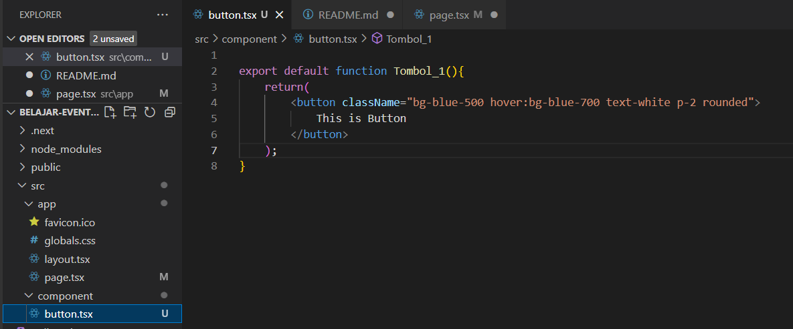
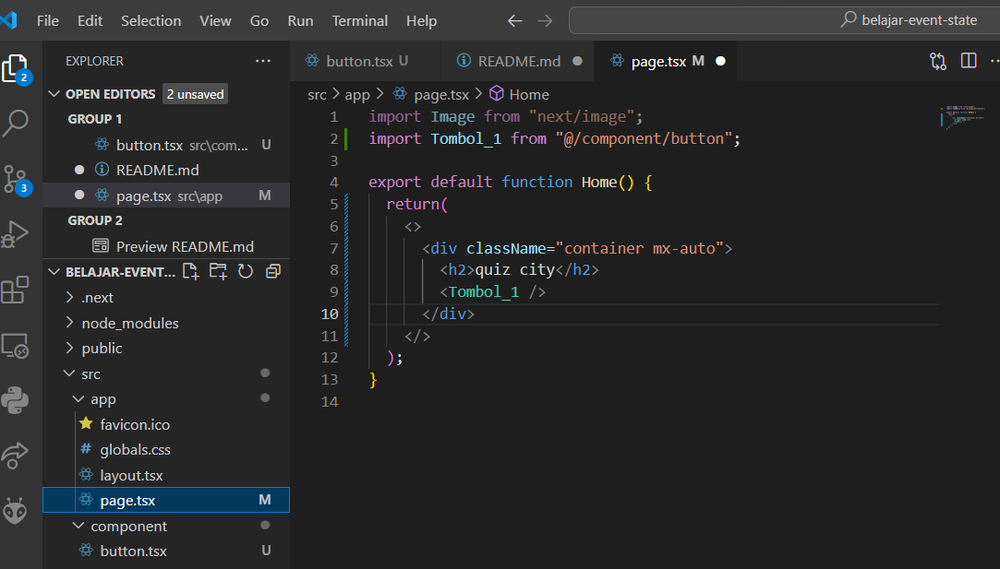
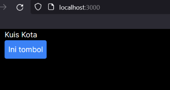
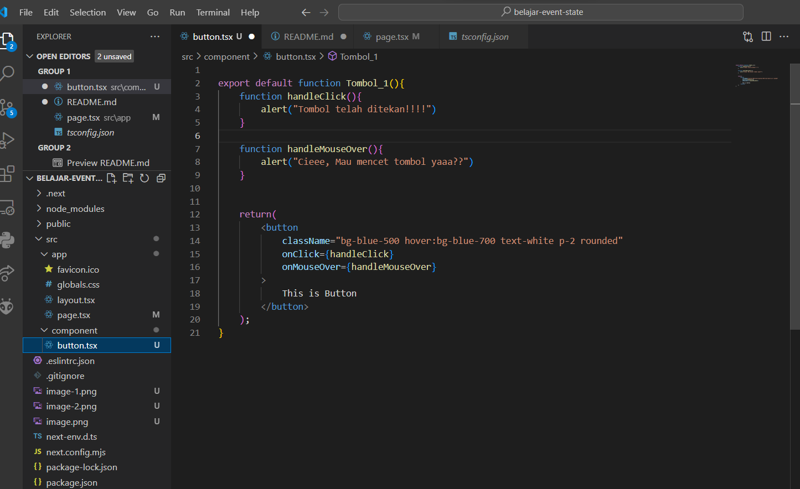
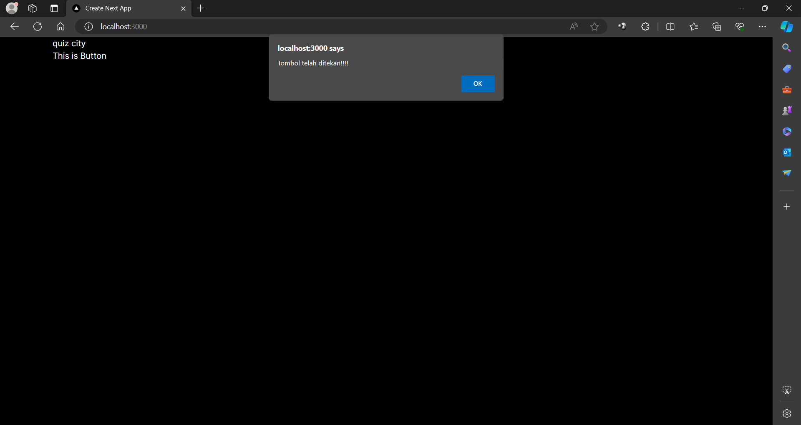
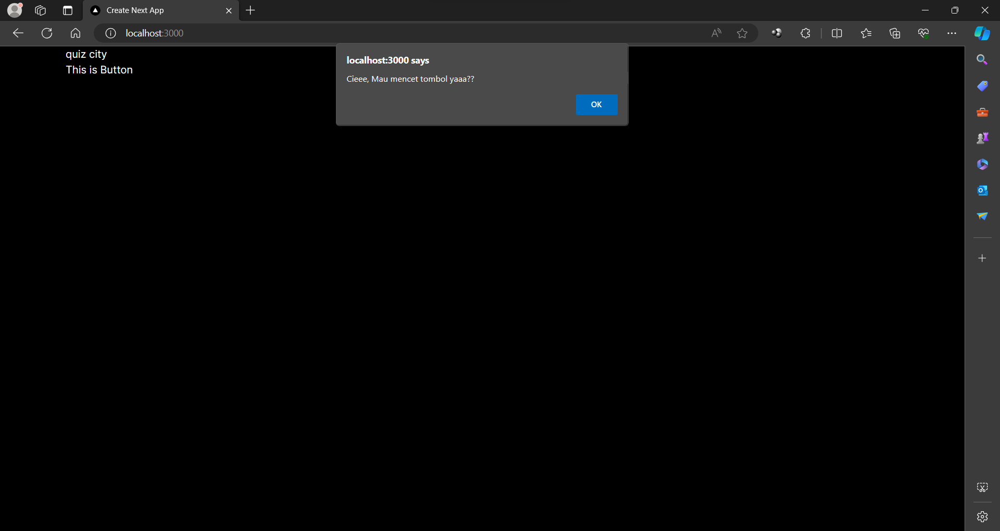
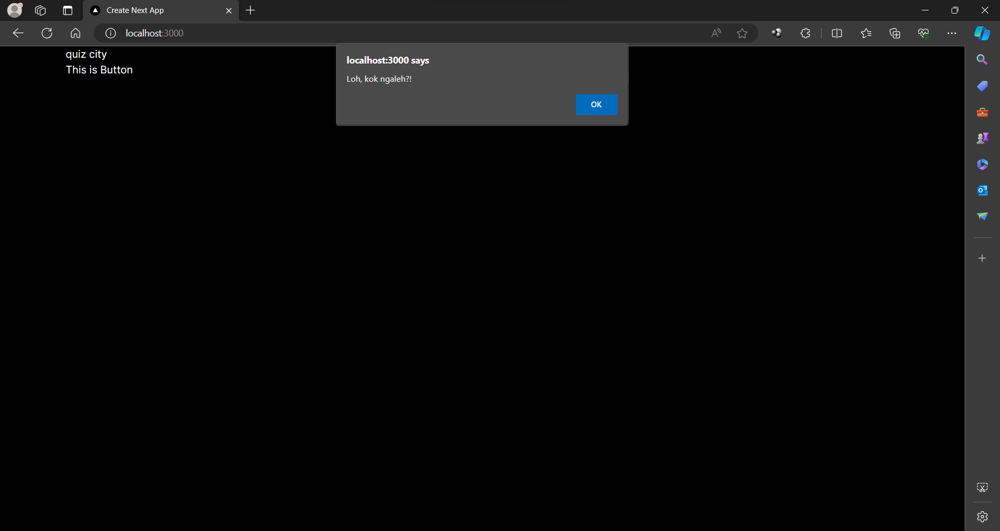

This is a [Next.js](https://nextjs.org/) project bootstrapped with [`create-next-app`](https://github.com/vercel/next.js/tree/canary/packages/create-next-app).

## Getting Started

First, run the development server:

```bash
npm run dev
# or
yarn dev
# or
pnpm dev
# or
bun dev
```

## Praktikum 1
Langkah 1
Kita mencoba membuat tombol sederhana yang belum bisa melakukan apa-apa alias belum kita buat event handler untuk tombol tersebut. Sebagai contoh, berikut adalah sebuah tombol yang belum melakukan apa pun. Kita buat folder/file baru di src/component/button.tsx


Selanjutnya pada file src/app/page.tsx kita ubah menjadi seperti berikut


Kemudian kita jalankan perintah "npm run dev" dan kita buka alamat localhost:3000 pada browser. Maka akan tampil hasil seperti berikut



Langkah 2
Kita bisa menambahkan event pada tombol tersebut. Seperti contoh kita buat ketika tombol di klik, akan memunculkan notif/alert. Kita dapat membuat pesan ketika pengguna mengeklik dengan mengikuti tiga langkah berikut:

Deklarasikan sebuah fungsi bernama handleClick di dalam komponen Button kita.
Implementasikan logika di dalam fungsi tersebut (gunakan alert untuk menampilkan pesan).
Tambahkan handler onClick={handleClick} ke tag JSX < button >




